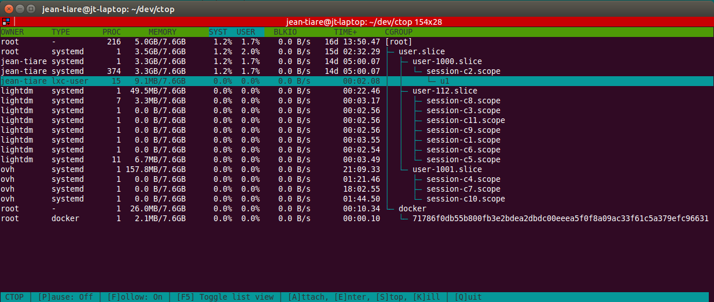

CTOP
====

A command line / text based Linux Containers monitoring tool that works just like you expect.

Introduction
------------

``ctop`` will help you see what's going on at the container level. Basically,
containers are a logical group of processes isolated using kernel's cgroups and
namespaces. Recently, they have been made popular by Docker and they are also
heavily used under the hood by systemd and a load of container tools like lxc,
rocket, lmctfy and many others.

Under the hood, ctop will collect all metrics it can from cgroups in realtime
and render them to instantly give you an overview of the global system health.

It currently collects metrics related to cpu, memory and block IO usage as well
as metadata such as owning user (mostly for systemd based containers), uptime
and attempts to guess the container managing technology behind.

When the container technology has been successfully guessed, additional features
are exposed like attaching to container (basically, it opens a shell in the
container context) and stopping it.

``ctop`` author uses it on production system to quicky detect biggest memory
users in low memory situations.

Features
--------

- collect cpu, memory and blkio metrics
- collect metadata like task count, owning user, container technology
- sort by any column
- optionally display logical/tree view
- optionally follow selected cgroup/container
- optionnaly pause the refresh (typically, to select text)
- detects Docker, LXC, unprivileged LXC and systemd based containers
- supports advanced features for Docker and LXC based containers
- open a shell/attach to supported container types for further diagnose
- stop/kill supported container types
- click to sort / reverse
- click to select cgroup
- no external dependencies beyond Python >= 2.6

Installation
------------

As a monitoring tool, ``ctop`` tries to be as dicrete as possible. Nonetheless
it still has some expectations. It will need at least Python 2.6 with builtin
curses support to run. This is usually found with Debian 6 and newer.

This said, the recommended installation method relies on pip

.. code:: bash

  pip install ctop
  ctop

If using pip is not an option, which is often the case on production systems,
you may also directly grab the self-contained source file directly from github
and run it in place. All you'll need is Python 2.6 (Debian Squeeze):

.. code:: bash

  wget https://raw.githubusercontent.com/yadutaf/ctop/master/cgroup_top.py -O ctop
  chmod +x ctop
  ./ctop

Alternatively, if you are a Boot2docker user, you may install a Dockerized
version of ctop instead. Please note that this is experimental and that you
may not be able to controll / attach to your containers from ctop using this
method:

.. code:: bash

  docker pull yadutaf/ctop
  docker run --volume=/sys/fs/cgroup:/sys/fs/cgroup:ro -it --rm yadutaf/ctop
  # Optionally, to resolve uids to usernames, add '--volume /etc/passwd:/etc/passwd:ro'

Usage
-----

**Command line**:

..code:: text

  Monitor local cgroups as used by Docker, LXC, SystemD, ...

  Usage:
    ctop [--tree] [--refresh=<seconds>] [--columns=<columns>] [--sort-col=<sort-col>] [--follow=<name>]
    ctop (-h | --help)

  Options:
    --tree                 Show tree view by default.
    --follow=<name>        Follow/highlight cgroup at path.
    --refresh=<seconds>    Refresh display every <seconds> [default: 1].
    --columns=<columns>    List of optional columns to display. Always includes 'name'. [default: owner,processes,memory,cpu-sys,cpu-user,blkio,cpu-time].
    --sort-col=<sort-col>  Select column to sort by initially. Can be changed dynamically. [default: cpu-user]
    -h --help              Show this screen.

**Control**:

- press ``p`` to toggle/pause the refresh and select text.
- press ``f`` to let selected line follow / stay on the same container. Default: Don't follow.
- press ``q`` or ``Ctrl+C`` to quit.
- press ``F5`` to toggle tree/list view. Default: list view.
- press ``↑`` and ``↓`` to navigate between containers.
- click on title line to select sort column / reverse sort order.
- click on any container line to select it.

Additionally, for supported container types (Currently Docker and LXC):

- press ``a`` to attach to console output.
- press ``e`` to open a shell in the container context. Aka 'enter' container.
- press ``s`` to stop the container (SIGTERM).
- press ``k`` to kill the container (SIGKILL).

Requirements
------------

* python >=2.6 with builtin curses support

Licence
-------

MIT

